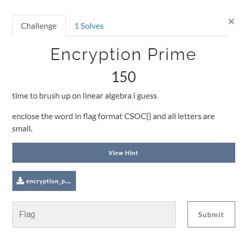

## Crypto

**Hint 1:** Try to guess the structure of the key Km with the given ciphertext and conditions
### Solution
If you carefully look at the conditions, the key matrix Km will not necessarily conserve the order of the plaintext letters.\
Plugging the letters that you get into any word unscrambler online will give you the intended word "dermatoglyphics"

flag : **CSOC\{dermatoglyphics}**