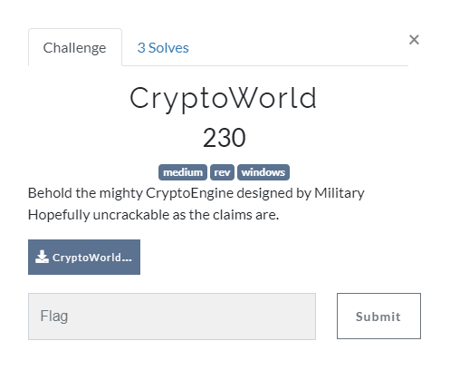

## Reversing

<p align="center"></p>

### Solution

Binary uses Crypto Library from wincrypt.h\
These use a secret key to encrypt or decrypt the actual data

Use IDA or GHIDRA to statically analyse the binary.\
Inside the main() function you can find
```C
	printf("Enter the Secret Key : ");
	scanf_s("%30s", input, 31);
	int len = strnlen(input, 30);

	if (len != 30)
		wrong_length();
	else
	{
		if (key_check(input))
			correct_key(input);
		else
			wrong_key();
	}
```
key_length=30\
soon after you will find bunch of cmps
```C
	if (pass[15] != 'i')
		return false;
	if (pass[16] != 's')
		return false;
	if (pass[17] != '_')
		return false;
	if (pass[18] != 'u')
		return false;
	if (pass[19] != 'n')
		return false;
	if (pass[20] != 'd')
		return false;

	if (pass[0] != 'm')
		return false;
	if (pass[1] != 'y')
		return false;
...
...
...
``` 
Arranging them 1 by 1 will gives you : **my_secret_code_is_undetectable**\
Enter that as the secret key and it outputs

```java

##Output
yeeeboi!
Heres your reward : csoc{@_11ttl3_JumBl3d_p@55}
```


flag : **csoc\{@_11ttl3_JumBl3d_p@55}**