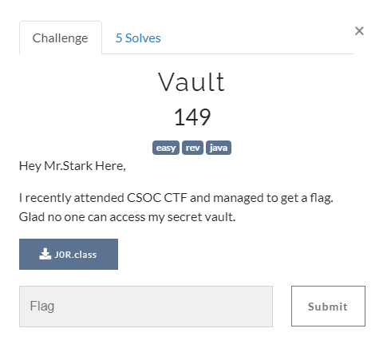

## Reversing

<p align="center"></p>

### Solution

Use an Online JAVA decompiler to get decompiled source code.\
Inside you will notice
```java
if(name.equals("J0Rvis") && pass.equals("luvyouthreethousand"))  <----------
{
	System.out.println("Logged in!\n\n");
	System.out.println("What do u want to do?");
	System.out.println("1.Make new Entry");
	System.out.println("2.Extract Entry");
```

Now that we have the Username & Password we can successfully login.
Choose option "Extract Entry" and it outputs

```python
Ahh..Heres my lovely flag
csoc{5t0r1n9_cr3dent1@l5_1n_@_pr0gr@m_15_@_51n}
```

flag : **csoc\{5t0r1n9_cr3dent1@l5_1n_@_pr0gr@m_15_@_51n}**