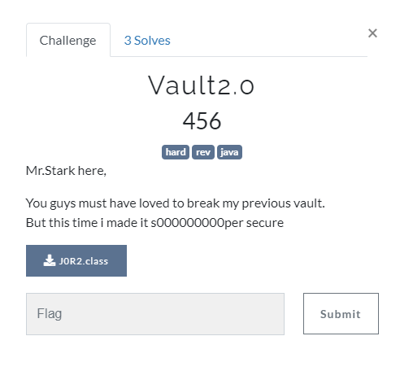

## Reversing

<p align="center"></p>

### Solution

Use an Online JAVA decompiler to get decompiled source code.
```java
System.out.print("Username : ");
name = sc.nextLine();		
System.out.print("Password : ");
pass = sc.nextLine();
if(obfuscate(name,0).equals("mister") && obfuscate(pass,1).equals("rossielikescats")) <------
{
	System.out.println("Logged in!\n\n");
	while(true)
	{

....

...
System.out.print("\nEnter your super secret master key(flag) :");
String flag=sc.nextLine();
if(obfuscate(flag,3).equals("D@mn_7h1s_m@st3r_k3y_1z_s000000oooop3r_l000000ng"))
```
Its obsfucating our inputs and then comparing with constant strings.\
Taking a further look inside **handleEntry()**
```java
case 2:
	System.out.println("Extracting Contents....\n");
	Sleep_c(500);
	System.out.println("Ah sorry!\n");
	System.out.println("Someone removed this feature!!!!\n");
	System.out.println("You are on your own now :p \n\n");
```
Unlike last program it does not contain inbuilt deobsfucator.\
So we start with reversing the encryption\
Looking at the obsfucator function we can see it first modifies the input here
```java
for (int i = 0; i < data.length(); i++)
	if (i % 2 == 0)
		hidden += (char) (data.charAt(i) + 3 * (i / 2));
	else
		hidden += data.charAt(i);		
```
Then inside **fix_me()** , It does
```java
int len= (adj.length < data.length)? adj.length :data.length;
	for (int i = 0; i < len; i++)
		st += (char) (data[i] + adj[i]);
	return st;
```
So the entire encryption is just modifying the input in two parts.\
Now we can write a simple code to reverse the encrypted texts back to orignal:

```java
public static String deobsfuscate(String data,int type)
{
	int[] adj;
	if(type==0)
	{
		adj=new int[]{24,-3,-4,2,47,4};
	}
	else if(type==1)
	{
		adj=new int[]{5,60,61,-1,22,
				50,34,-11,12,53,
				-7,51,-39,67,-3};
	}
	else
	{
		adj=new int[]{-31,-51,-5,11,-34,-11,-22,-67,8,47,-1,-31,
				49,21,-25,10,22,-8,-71,66,16,-60,-12,0,
				30,-47,-42,-62,-61,-66,-118,-1,-53,60,-40,17,
				-54,-4,-13,-6,-133,-47,-70,-56,-67,-62,-62,-22,};
										
	}	
	String extract = "";
	for (int i = 0; i < data.length(); i++)
		extract += (char) (data.charAt(i) - adj[i]);
		
	String hidden = "";
	for (int i = 0; i < data.length(); i++)
		if (i % 2 == 0)
			hidden += (char) (extract.charAt(i) - 3 * (i / 2));
		else
			hidden += extract.charAt(i);		
			
	return hidden;
}
```
```java
//Code Testing
System.out.println(deobsfuscate("mister",0));					---->  Ultr0n
System.out.println(deobsfuscate("rossielikescats",1));			---->	m33tM3AtS0k0v1a																		
System.out.println(deobsfuscate("D@mn_7h1s_m@st3r_k3y_1z_s000000oooop3r_l000000ng",3)); -->csoc{But_0__0_7h1s_71me_1_3nCrypt3d_3v3ry_7h1ng}
```

flag : **csoc\{But_0__0_7h1s_71me_1_3nCrypt3d_3v3ry_7h1ng}**