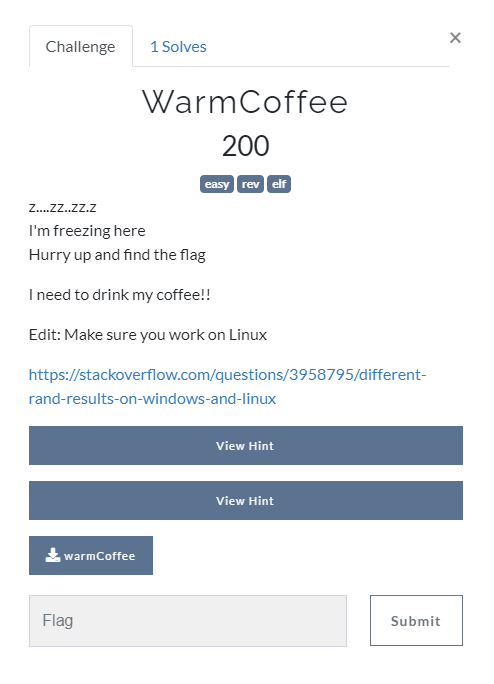

## Reversing

<p align="center"></p>

**Hint 1:** GHIDRA and IDA your buddies\
**Hint 2:** Is rand() really random?

### Solution

Looking at the **check_key()** function
```C
int check_key(char* key)
{
	srand(0x1337);

	int exp = rand() % 0x20;
	const char data[] = "fvjf~67|Z}5wZc5wZrEWH4kbZpux";

	for (int i = 0; i < flag_len; i++)
	{
		if ((key[i] ^ exp) != data[i])
			return 0;
	}
	return 1;

}
```
**Method 1:**\
Refer to : [rand() and srand() in C/C++ - GeeksforGeeks](https://www.geeksforgeeks.org/rand-and-srand-in-ccpp/)\
rand() in it self generates pseudo_random numbers which are not completely random.\
A constant seed(0x1337) is provided for srand() means that subsequent values of rand() will be same upon each runtime.\
This means our **int exp = rand() % 0x20;** will store a constant value

We can find the value stored by making a simple program
```C
#include <stdio.h>
#include <stdlib.h>
int main()
{

	srand(0x1337);
	int exp=rand() % 0x20;
	printf("%d\n",exp);  ---> returns 5
	return 0;
}
```
This needs to be run under Linux as the Challenge description said :

> Edit: Make sure you work on Linux\
> https://stackoverflow.com/questions/3958795/different-rand-results-on-windows-and-linux

Then use that key to decode the encrypted flag
```python
>>> p ="fvjf~67|Z}5wZc5wZrEWH4kbZpux"
>>> p=' '.join([chr(ord(i)^5) for i in p])
>>> p
'csoc{32y_x0r_f0r_w@RM1ng_up}'
```

**Method 2:**\
Inside the **check_key()** function,\
Each character of our input is xored by same value\
Since we know that the flag starts **csoc**
We can simply find our **exp** by 
```python
>>> ord('f') ^ ord('c')
5
```

flag : **csoc\{32y_x0r_f0r_w@RM1ng_up}**