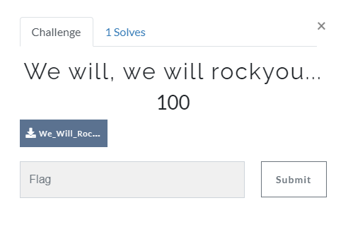

## Steganography

### Solution

Download the "rockyou.txt" wordlist. It is a list of the most common passwords.\
Now run the following command with the wordlist and the audio file in the same directory:\
**stegseek We_Will_Rock_You.wav rockyou.txt**

flag : **csoc\{we_W1l1_rOCk_yOu}**